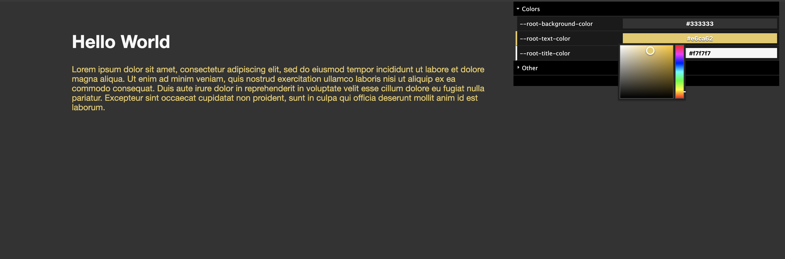

# css-var-editor
A [dat.gui](https://github.com/dataarts/dat.gui) editor which will detect all
root css variables of a site and presents them in the editor.
From there you can preview you changes.

## Install

Add this to your index.html

    
    
And you are done. Enjoy =)

## Example 

[Demo](https://faebeee.github.io/css-var-editor/index.html)

## Bookmark snippet

    javascript:(function(){s=document.createElement('script');s.type='text/javascript';s.src='https://unpkg.com/css-var-editor?v='+parseInt(Math.random()*99999999);document.body.appendChild(s);})();
    
[Bookmark](javascript:(function(){s=document.createElement('script');s.type='text/javascript';s.src='https://unpkg.com/css-var-editor?v='+parseInt(Math.random()*99999999);document.body.appendChild(s);})();)
